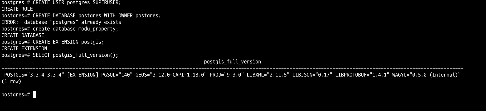

# [ERD](https://www.erdcloud.com/d/egr2NSsXmeZ6HiJnJ)

# 설정
## debugging
.vscode 디렉토리에 launch.json 생성.  
 아래 입력 후 브레이크포인트 찍고 F5 클릭
```json
{
    // Use IntelliSense to learn about possible attributes.
    // Hover to view descriptions of existing attributes.
    // For more information, visit: https://go.microsoft.com/fwlink/?linkid=830387
    "version": "0.2.0",
    "configurations": [
        {
            "name": "Python: Django",
            "type": "python",
            "request": "launch",
            "program": "${workspaceFolder}/manage.py",
            "args": ["runserver", "--settings", "modu_property.settings.local_settings"],
            "env": {"DEBUG": "False"},
            "envFile": "${workspaceFolder}/.env.local",
            "console": "integratedTerminal",
            "justMyCode": true,
            "django": true
            // "cwd": "${workspaceFolder}/tests",
        }
    ]
}
```

## docker-compose
* docker-compose.local.yml에서 manticore, django service의 network_mode: "host"로 수정

파일 검증 : 
* docker compose -f docker-compose.local.yml config
* docker-compose -f docker-compose.testing.yml config
* docker-compose -f docker-compose.dev.yml config

## postgis
spatial db를 위해 postgis 설치해야 함  
brew install postgresql 이미 설치 됐으면 스킵, 실행 brew services start postgresql@14  
brew install postgis gdal libgeoip  

# run server
로컬 서버 : docker compose 권장
* docker compose -f docker-compose.local.yml up -d  
* docker compose -f docker-compose.local.yml up -d --build  
* docker compose -f docker-compose.local.yml up -d --build --force-recreate  
* SERVER_ENV=local python manage.py runserver --settings modu_property.settings.local_settings  

테스팅 서버
* docker-compose -f docker-compose.testing.yml up -d --build
* docker-compose -f docker-compose.testing.yml up -d --build --force-recreate

# migrate
SERVER_ENV 설정하기, django container에서 실행하기
## local용
* migration
    * SERVER_ENV=local python manage.py makemigrations --settings=modu_property.settings.local_settings
* migrate
    * SERVER_ENV=local python manage.py migrate --settings=modu_property.settings.local_settings

## testing용 (ec2, RDS)
* migrate
    로컬에서 testing 컨테이너 띄우고 장고 컨테이너 접속, migrate
    * docker exec -it {container id} sh
    * SERVER_ENV=testing python3 manage.py migrate --settings=modu_property.settings.testing_settings

### migrate
#### rollback  
SERVER_ENV=local python manage.py showmigrations real_estate  
SERVER_ENV=local python manage.py migrate --settings=modu_property.settings.local_settings {app name} {migration file name}  

# postgres 접속
psql -h 127.0.0.1 -U postgres -d modu_property -p 5432

psql 안되면
```sh
createdb --owner=postgres --encoding=utf8 user
psql postgres;
CREATE USER postgres SUPERUSER;
CREATE DATABASE postgres WITH OWNER postgres;
create database modu_property;
CREATE EXTENSION postgis;
SELECT postgis_full_version();
```


django.db.utils.DataError: invalid value for parameter "TimeZone": "UTC"  
-> brew services restart postgresql@14 안됨  
->  brew link postgresql@14, brew link --overwrite postgresql   
`DB 싹 지웠다가 재설치 시도함`

# search engine
manticore search   
https://github.com/manticoresoftware/manticoresearch-python/tree/3.3.1  
https://github.com/manticoresoftware/manticoresearch-python/blob/master/test/test_manual.py

기본 manticore.conf
```
searchd {
    listen = 127.0.0.1:9312
    listen = 127.0.0.1:9306:mysql
    listen = 127.0.0.1:9308:http
    log = /opt/homebrew/var/log/manticore/searchd.log
    query_log = /opt/homebrew/var/log/manticore/query.log
    pid_file = /opt/homebrew/var/run/manticore/searchd.pid
    data_dir = /opt/homebrew/var/manticore  # plain table이라 이거 없어야 함
}

searchd {
    # Manticore Search server listening address and port
    listen = 9312
    # Manticore Search server query daemon
    listen = 9306:mysql41
    listen = 0.0.0.0:9308:http
    pid_file = /var/run/manticore/searchd.pid
    log = /var/log/manticore/searchd.log
}
```

수정 
```
searchd {
    listen = 127.0.0.1:9312
    listen = :9306:mysql
    listen = 0.0.0.0:9308:http # 이렇게 해야 local에서 mantocore의 http로 접근 가능함
    log = /opt/homebrew/var/log/manticore/searchd.log
    query_log = /opt/homebrew/var/log/manticore/query.log
    pid_file = /opt/homebrew/var/run/manticore/searchd.pid
    data_dir = /opt/homebrew/var/manticore  # plain table이라 이거 없어야 함
}
```

검색 관련 변경 시 manticore.conf.template 수정해야 함

real_estate 검색 테스트 준비  
* docker compose 실행  
로컬에서  
* SERVER_ENV=local python manage.py insert_real_estates_for_searching_command  
* 검색 테스트 실행  

```
manticore terminal에서 실행할 명령어
* indexer
    db 데이터 인덱싱
    * indexer --config /etc/manticoresearch/manticore.conf --all

    FATAL: failed to lock /var/lib/manticore/property_villa.spl: Resource temporarily unavailable, will not index. Try --rotate option.
    -> 
    * indexer --config /etc/manticoresearch/manticore.conf --all --rotate
또는  
SERVER_ENV=local python run_indexer.py  

* searchd 준비 됐는지 상태 확인
    * searchd --config /etc/manticoresearch/manticore.conf
    * searchd --config /etc/manticoresearch/manticore.conf --status
```

```
9306에서 테이블은 있는데 search 쿼리 날리면 field 못찾는 경우 아래 명령어 실행하기
mysql -P9306 -h0 -e "RELOAD TABLES"
mysql -P9306 -h0 -e "RELOAD INDEXES"

9306 접속해서 쿼리 실행
mysql -P9306 -h0;  
select * from real_estate where match('@* *반포*');  
```

min_infix_len = 2  
min_prefix_len = 1  

```bash
table 확인 curl
curl -s 'http://127.0.0.1:9308/cli_json?show%20tables'

# 검색엔진 쿼리

# DB_HOST_FOR_MANTICORE가 rds인 경우
# ec2 django container에서 실행  
curl --location 'http://127.0.0.1:9308/search' --header 'Content-Type: application/json' --data '{"index": "real_estate", "query": { "match": {"*":"*반포*"}}}'

# DB_HOST_FOR_MANTICORE가 host.docker.internal인 경우
# 로컬 django container에서 실행  
curl --location 'http://host.docker.internal:9308/search' --header 'Content-Type: application/json' --data '{"index": "real_estate", "query": { "match": {"*":"*반포*"}}}'
```

# pytest
`pytest`  
병렬 실행 : `pytest -n {n}`

# API
## 공공데이터
[국토교통부_연립다세대 매매 실거래자료](https://www.data.go.kr/tcs/dss/selectApiDataDetailView.do?publicDataPk=15058038)  
[국토교통부_연립다세대 전월세 자료](https://www.data.go.kr/tcs/dss/selectApiDataDetailView.do?publicDataPk=15058016)  
[국토교통부_아파트매매 실거래자료](https://www.data.go.kr/iim/api/selectAPIAcountView.do)  
[국토교통부_아파트 전월세 자료](https://www.data.go.kr/iim/api/selectAPIAcountView.do)  

## 카카오 API
* 구주소 -> 신주소 변환 및 위도경도 구하기 : [로컬](https://developers.kakao.com/docs/latest/ko/local/common)

## pre-commit
커밋할 때 black 적용 안되어 있으면 커밋 실패하게 하는 용도로 씀.  
.pre-commit-config.yaml

# open api
http://localhost:8000/api/docs/  
회원가입 테스트 시 content-type을 multipart/form-data로 지정해야 함  

# logging
pytest 관련 로그는 pytest.ini에서 설정함  
파일에 로그 저장하고 싶으면 pytest.ini에서 콘솔에 로그 capture하는거 막아야 함 `addopts=-p no:logging`  

# 데이터 수집
## Region 테이블에 지역 코드 수집. 법정동이 바뀌지 않는 이상 DB에 한번 적용하면 됨.
SERVER_ENV=local python manage.py collect_regional_code_command  

ec2 사양 딸려서 로컬 터미널에서 실행  
SERVER_ENV=testing python manage.py collect_regional_code_command

sql 파일에 있는거 insert
SERVER_ENV=testing python manage.py insert_regional_code_command


## 전체/특정지역 부동산 매매 정보 수집 명령어
전국의 빌라, 아파트에 대해 2006년부터 현재까지 수집하도록 함, docker 사용하기 때문에 container 안에서 실행하면 안됨!. DB_HOST=127.0.0.1로 바꿔야함  
SERVER_ENV=local python manage.py collect_deal_price_of_real_estate_command 서울특별시  

로컬 터미널에서 testing RDS에 반영  
SERVER_ENV=testing python manage.py collect_deal_price_of_real_estate_command 서울특별시  

# 현재 연월의 부동산 매매 정보 수집 스케쥴러
collect_deal_price_of_real_estate_command 으로 전체 수집을 했다면, collect_deal_price_of_real_estate_task 스케쥴러로 최신 데이터 수집함  

# 전체/특정지역 통계 정보 수집 명령어
SERVER_ENV=local python manage.py collect_region_price_command 서울특별시  

SERVER_ENV=testing python manage.py collect_region_price_command 서울특별시  

# ngrok
`ngrok http --host-header=localhost 80`  

# localxpose
loclx tunnel http --to localhost:80  

# docker hub에 push된 이미지로 로컬에서 테스트하기
docker login -u gidlemyeon -p {password}  
docker pull gidlemyeon/modu_property_platform_development:django  
docker-compose -f docker-compose.testing.yml up -d

# serializer 사용 방법
https://velog.io/write?id=d7202849-3ed9-4fc2-931b-f4f6968cb834

serializer에 model을 넘기는 경우 serializer.data 사용
```python
_serializer = RegionSerializer(data=region_models, many=True)
_serializer.data
```

serializer.validated_data
```python
_serializer.is_valid(raise_exception=True)
_serializer.validated_data # 검증된 데이터 사용, save()하기 전 처리할 때 쓰일 수 있음
```

serializer.data # validated_data의 serialize된 표현
```python
_serializer = serializer(instance=model, data=data, many=many)
_serializer.is_valid(raise_exception=True)
data = _serializer.data
```

# schema decorator 작성 방법
schema 디렉토리에 파일 생성하고 아래 형식으로 작성
"""
def get_xxx_view_get_decorator(view_function):
    decorated_view_function =extend_schema()(view_function)

    return decorated_view_function
"""

# TODO
23.12.05  
* https://www.notion.so/2-5ddb861b8a5d468eac0b71b1238a41aa  
