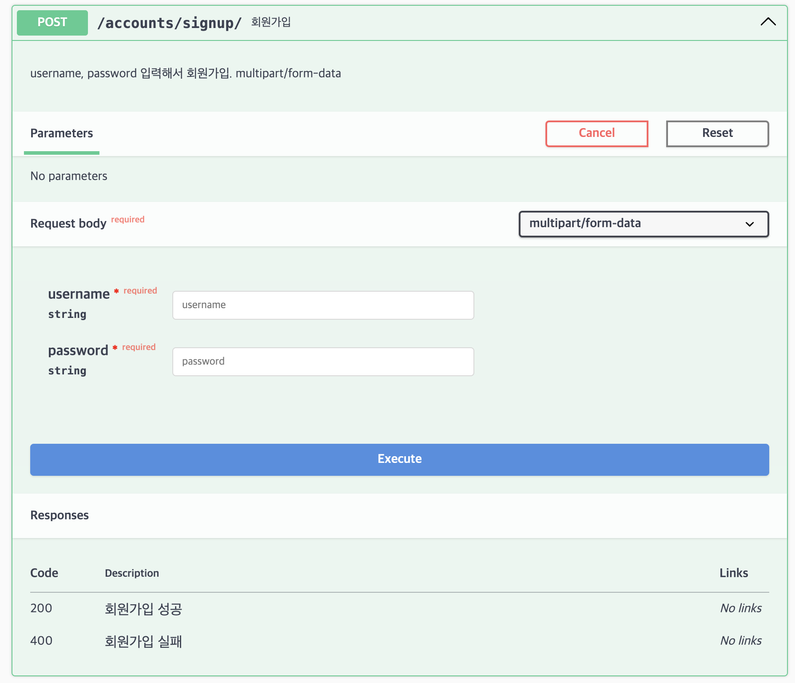

# [ERD](https://www.erdcloud.com/d/egr2NSsXmeZ6HiJnJ)

# Used
* jwt
* serializer
* sqlite
* form
* celery
* redis
* pytest
* pytest-xdist
* docker-compose
* mysql

# run server
로컬 서버
* export SERVER_ENV=local
* SERVER_ENV=local python manage.py runserver --settings modu_property.local_settings 
* docker compose -f docker-compose.local.yml up -d --build --force-recreate

테스팅 서버
* docker-compose -f docker-compose.testing.yml up -d --build --force-recreate

# docker-compose
* docker-compose.local.yml에서 manticore, django service의 network_mode: "host"로 수정
* docker-compose -f docker-compose.local.yml up -d --build --force-recreate

파일 검증 : 
* docker-compose -f docker-compose.local.yml config
* docker-compose -f docker-compose.dev.yml config


# debugging
.vscode 디렉토리에 launch.json 생성
아래 입력 후 브레이크포인트 찍고 F5 클릭
```json
{
    // Use IntelliSense to learn about possible attributes.
    // Hover to view descriptions of existing attributes.
    // For more information, visit: https://go.microsoft.com/fwlink/?linkid=830387
    "version": "0.2.0",
    "configurations": [
        {
            "name": "Python: Django",
            "type": "python",
            "request": "launch",
            "program": "${workspaceFolder}/manage.py",
            "args": ["runserver", "--settings", "modu_property.local_settings"],
            "env": {"DEBUG": "False"},
            "envFile": "${workspaceFolder}/.env.local",
            "console": "integratedTerminal",
            "justMyCode": true,
            "django": true
            // "cwd": "${workspaceFolder}/tests",
        }
    ]
}
```

# pycharm setting
run server

run celery

run celery task


result


celery 사용법
* celery beat 실행해서 redis 큐에 주기적으로 task 넣기
* celery worker 실행해서 redis 큐에 있는 task 실행

# pytest
`pytest`

`pytest -n {n}`


# API
## 공공데이터
[국토교통부_연립다세대 매매 실거래자료](https://www.data.go.kr/tcs/dss/selectApiDataDetailView.do?publicDataPk=15058038)
[국토교통부_연립다세대 전월세 자료](https://www.data.go.kr/tcs/dss/selectApiDataDetailView.do?publicDataPk=15058016)

## 카카오 API
* 구주소 -> 신주소 변환 및 위도경도 구하기 : [로컬](https://developers.kakao.com/docs/latest/ko/local/common)

# search engine
manticore search
https://github.com/manticoresoftware/manticoresearch-python/tree/3.3.1

https://github.com/manticoresoftware/manticoresearch-python/blob/master/test/test_manual.py

기본 manticore.conf
```
searchd {
    listen = 127.0.0.1:9312
    listen = 127.0.0.1:9306:mysql
    listen = 127.0.0.1:9308:http
    log = /opt/homebrew/var/log/manticore/searchd.log
    query_log = /opt/homebrew/var/log/manticore/query.log
    pid_file = /opt/homebrew/var/run/manticore/searchd.pid
    data_dir = /opt/homebrew/var/manticore  # plain table이라 이거 없어야 함
}


searchd {
    # Manticore Search server listening address and port
    listen = 9312
    # Manticore Search server query daemon
    listen = 9306:mysql41
    listen = 0.0.0.0:9308:http
    pid_file = /var/run/manticore/searchd.pid
    log = /var/log/manticore/searchd.log
}
```

수정 
```
searchd {
    listen = 127.0.0.1:9312
    listen = :9306:mysql
    listen = 0.0.0.0:9308:http # 이렇게 해야 local에서 mantocore의 http로 접근 가능함
    log = /opt/homebrew/var/log/manticore/searchd.log
    query_log = /opt/homebrew/var/log/manticore/query.log
    pid_file = /opt/homebrew/var/run/manticore/searchd.pid
    data_dir = /opt/homebrew/var/manticore  # plain table이라 이거 없어야 함
}
```

```
manticore terminal에서 실행할 명령어
* indexer
    db 데이터 인덱싱
    * indexer --config /etc/manticoresearch/manticore.conf --all

    FATAL: failed to lock /var/lib/manticore/property_villa.spl: Resource temporarily unavailable, will not index. Try --rotate option.
    -> 
    * indexer --config /etc/manticoresearch/manticore.conf --all --rotate

* searchd 준비 됐는지 상태 확인
    * searchd --config /etc/manticoresearch/manticore.conf
    * searchd --config /etc/manticoresearch/manticore.conf --status


9306에서 테이블은 있는데 search 쿼리 날리면 field 못찾는 경우 아래 명령어 실행하기
mysql -P9306 -h0 -e "RELOAD TABLES"
mysql -P9306 -h0 -e "RELOAD INDEXES"

mysql -P9306 -h0;


min_infix_len = 2
min_prefix_len = 1
select * from property_villa where match('@dong *동');

table 확인 curl
curl -s 'http://127.0.0.1:9308/cli_json?show%20tables'

로컬 터미널에서 manticore 컨테이너 mysql 호출
curl --location 'http://127.0.0.1:9308/search' --header 'Content-Type: application/json' --data '{"index": "villa", "query": { "match": {"road_name_address":"*주흥*"}}}'

curl --location 'http://127.0.0.1:9308/search' --header 'Content-Type: application/json' --data '{"index": "villa", "query": { "match": {"lot_number":"*반포*"}}}'

curl --location 'http://127.0.0.1:9308/search' --header 'Content-Type: application/json' --data '{"index": "villa", "query": { "match": {"name":"*신천*"}}}'
> local db에 데이터 넣고 sh ./manticore/run_indexer.sh 실행한다음 manticore 테스트 코드 돌리기

```

# postgis
spatial db를 위해 postgis 설치해야 함

brew install postgresql 이미 설치 됐으면 스킵, 실행 brew services start postgresql@14
brew install postgis gdal libgeoip

# migrate
SERVER_ENV 설정하기
## local용
* migration
    * SERVER_ENV=local python manage.py makemigrations --settings=modu_property.local_settings
* migrate
    * SERVER_ENV=local python manage.py migrate --settings=modu_property.local_settings

## testing용 (ec2, RDS)
* migrate
    * SERVER_ENV=testing python manage.py migrate --settings=modu_property.testing_settings


# postgres 접속
psql -h 127.0.0.1 -U postgres -d modu_property -p 5432

psql 안되면
createdb --owner=postgres --encoding=utf8 user

psql postgres;
CREATE USER postgres SUPERUSER;
<!-- CREATE DATABASE postgres WITH OWNER postgres; -->
create database modu_property;
CREATE EXTENSION postgis;
SELECT postgis_full_version();


django.db.utils.DataError: invalid value for parameter "TimeZone": "UTC"
-> brew services restart postgresql@14 안됨
->  brew link postgresql@14, brew link --overwrite postgresql 

DB 싹 지웠다가 재설치 시도함

# TODO
23.10.11
도커 컨테이너 실행되면 indexing하는 코드 호출해서 indexing되는지 확인하기
search도 하기

## pre-commit
커밋할 때 black 적용 안되어 있으면 커밋 실패하게 하는 용도로 씀.
.pre-commit-config.yaml

# open api
http://localhost:8000/api/docs/

회원가입 테스트 시 content-type을 multipart/form-data로 지정해야 함
